# Additional Resources for RFVision

## RF Image
### 10 FMCW Frequencies

| Overshot  | 77 GHz  | 77.008 GHz  | 77.016 GHz | 77.024 GHz | 77.032 GHz | 77.040 GHz | 77.048 GHz | 77.056 GHz | 77.064 GHz | 77.072 GHz |
|  :------:  | ----  | ----  | ----  | ----  | ----  | ----  | ----  | ----  | ----  | ----  |
| 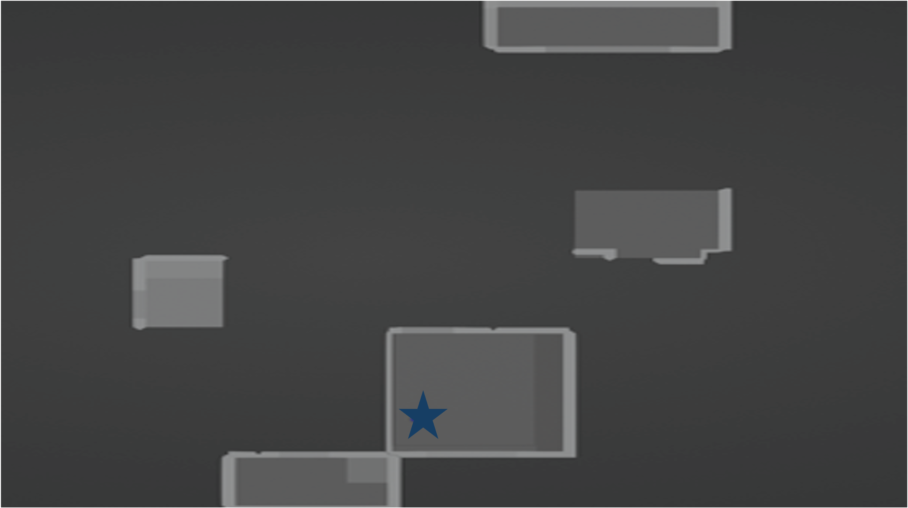 | 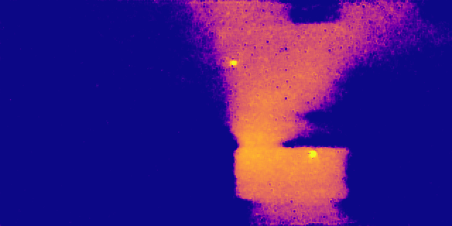 |  | 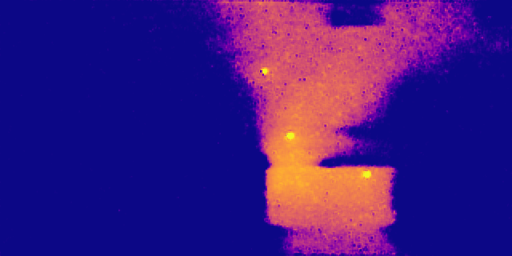 | 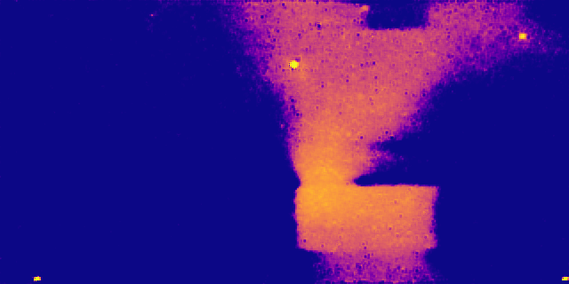 | 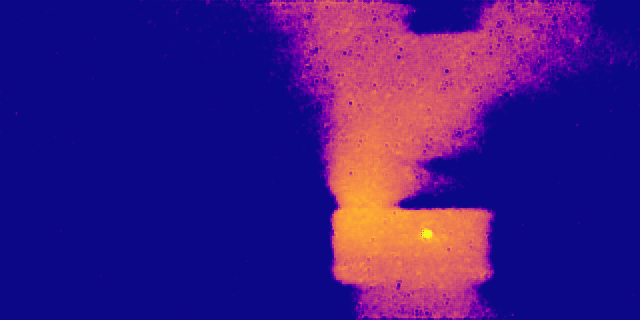 | 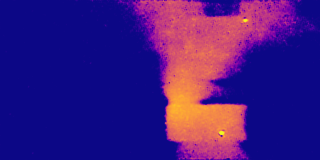 | 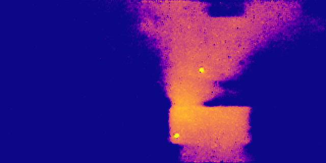 | 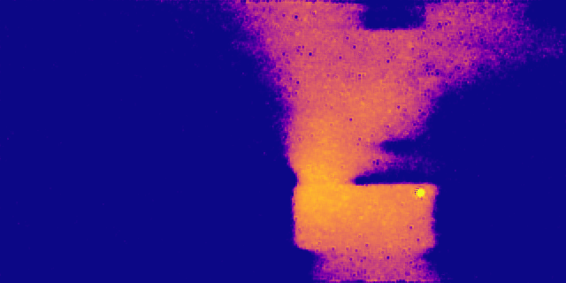 | 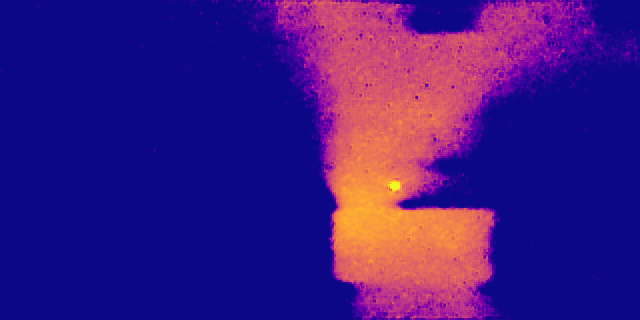 |  |
| 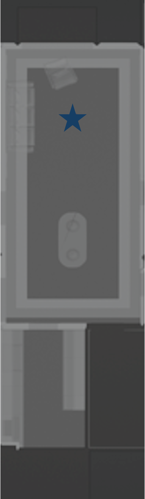 | 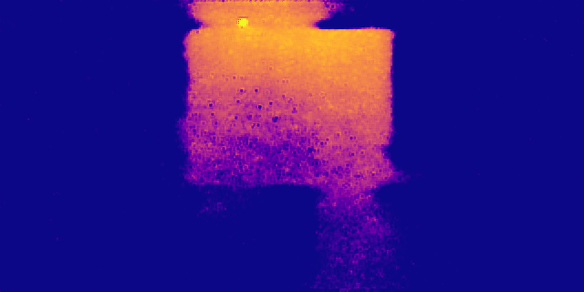 | 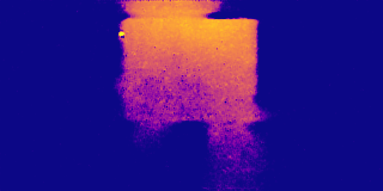 |  | 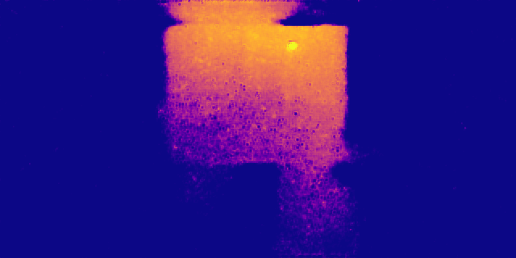 | 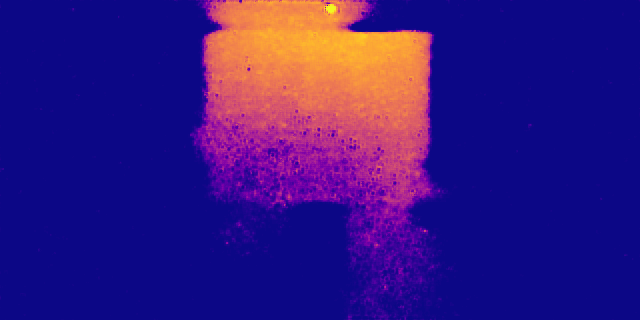 | 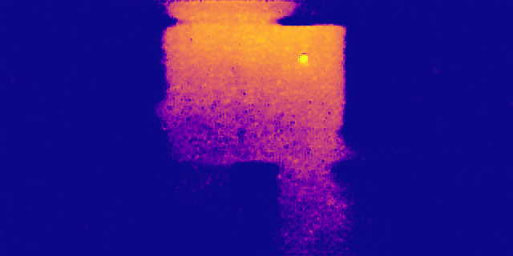 | 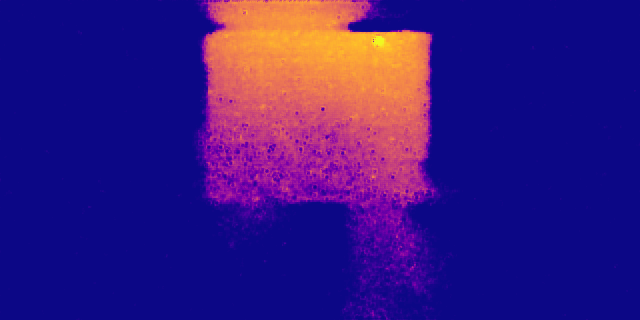 | 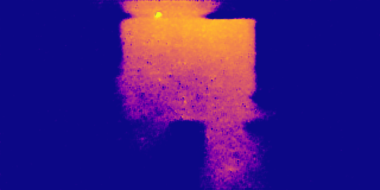 | 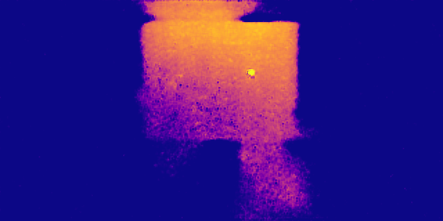 | 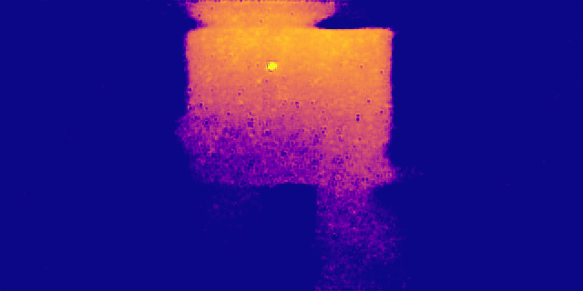 |

**Note: Star icon  in overshot images represents the AP.**

## RF Video (To Be Updated)

